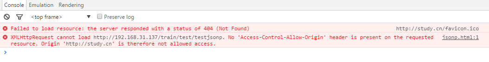

#### 一、什么是跨域问题？

##### 	1.1、什么是跨域？

   		跨域的产生来源于现代浏览器所通用的‘同源策略’，所谓同源策略，是指只有在地址的：

​           1、协议名 https，http

​           2、域名 http://a.study.cn http://study.cn

​           3、端口名 http://study.cn:8080/json/jsonp/jsonp.html study.cn/json/jsonp/jsonp.html
均一样的情况下，才允许访问相同的cookie、localStorage或是发送Ajax请求等等。若在不同源的情况下访问，就称为跨域。

​    **举例如下**：

   

这个时候在浏览器上会报错:



这个就是同源策略的保护,如果浏览器对javascript没有同源策略的保护,那么一些重要的机密网站将会很危险~

```
请求地址                                     形式                  结果
http://study.cn/test/a.html                同一域名,不同文件夹      成功
http://study.cn/json/jsonp/jsonp.html      同一域名,统一文件夹      成功
http://a.study.cn/json/jsonp/jsonp.html    不同域名,文件路径相同    失败
http://study.cn:8080/json/jsonp/jsonp.html 同一域名,不同端口        失败
https://study.cn/json/jsonp/jsonp.html     同一域名,不同协议　　     失败
```

#####    1.2、什么情况下会产生跨域安全问题？

​      1、浏览器限制 ： 如何屏蔽掉浏览器限制就不会产生问题。

​      2、跨域 ： 不满足同源策略。

​      3、XMLHttpRequest请求 ： 发送的是XMLHttpRequest请求。

#### 二、为什么要做跨域限制？

​    **安全！**同源策略（Same origin policy）是一种约定，它是浏览器最核心也最基本的安全功能，如果缺少了同源策略，则浏览器的正常功能可能都会受到影响。可以说 Web 是构建在同源策略基础之上的，浏览器只是针对同源策略的一种实现。

它的核心就在于它认为自任何站点装载的信赖内容是不安全的。当被浏览器半信半疑的脚本运行在沙箱时，它们应该只被允许访问来自同一站点的资源，而不是那些来自其它站点可能怀有恶意的资源。

​    所谓同源是指：**域名、协议、端口相同**。

  **如果浏览器没有同源策略，会存在什么样的安全问题呢。**

  下面从 DOM 同源策略和 XMLHttpRequest 同源策略来举例说明：

  **如果没有 DOM 同源策略，也就是说不同域的 iframe 之间可以相互访问，那么黑客可以这样进行攻击：**

1. 做一个假网站，里面用 iframe 嵌套一个银行网站 http://mybank.com。
2. 把 iframe 宽高啥的调整到页面全部，这样用户进来除了域名，别的部分和银行的网站没有任何差别。
3. 这时如果用户输入账号密码，我们的主网站可以跨域访问到 http://mybank.com 的 dom 节点，就可以拿到用户的账户密码了。

  **如果 XMLHttpRequest 同源策略，那么黑客可以进行 CSRF（跨站请求伪造） 攻击：**

1. 用户登录了自己的银行页面 http://mybank.com，http://mybank.com 向用户的 cookie 中添加用户标识。
2. 用户浏览了恶意页面 http://evil.com，执行了页面中的恶意 AJAX 请求代码。
3. http://evil.com 向 http://mybank.com 发起 AJAX HTTP 请求，请求会默认把 http://mybank.com 对应 cookie 也同时发送过去。
4. 银行页面从发送的 cookie 中提取用户标识，验证用户无误，response 中返回请求数据。此时数据就泄露了。
5. 而且由于 Ajax 在后台执行，用户无法感知这一过程。

   因此，有了浏览器同源策略，我们才能更安全的上网。


#### 三、如何解决跨域

​    **3.1、解决思路：**

​			1、浏览器限制：不现实。

​            2、XMLHttpRequest请求：不发送这个类型的请求，JSONP，不建议。

​            3、跨域：建议。

​                  支持跨域：被调用方返回结果带上某些信息告诉浏览器支持该域名调用。

​                  隐藏跨域：调用方调用某个代理，代理将域名转到同一个域名，浏览器看到的结果是同一个域名。

​    3.2、实战：

​            1、去除浏览器限制：

​                  --args --disable-web-security  --user-data-dir=D:\chrome

​            2、JSONP解决跨域：

​				     JSONP是一种依靠开发人员的聪明才智创造出的一种非官方跨域数据交互协议。浏览器限制了XMLHttpRequest ，那么绕过它，弄个JSONP出来。

​                     演变背景：

​                      **1、一个众所周知的问题，Ajax直接请求普通文件存在跨域无权限访问的问题，甭管你是静态页面、动态网页、web服务、WCF，只要是跨域请求，一律不准；**

​			      	  **2、不过我们又发现，Web页面上调用js文件时则不受是否跨域的影响（不仅如此，我们还发现凡是拥有"src"这个属性的标签都拥有跨域的能力，比如<script>、、<iframe>）；**

​      				  **3、于是可以判断，当前阶段如果想通过纯web端（ActiveX控件、服务端代理、属于未来的HTML5之Websocket等方式不算）跨域访问数据就只有一种可能，那就是在远程服务器上设法把数据装进js格式的文件里，供客户端调用和进一步处理；**

  					  **4、恰巧我们已经知道有一种叫做JSON的纯字符数据格式可以简洁的描述复杂数据，更妙的是JSON还被js原生支持，所以在客户端几乎可以随心所欲的处理这种格式的数据；**

 					  **5、这样子解决方案就呼之欲出了，web客户端通过与调用脚本一模一样的方式，来调用跨域服务器上动态生成的js格式文件（一般以JSON为后缀），显而易见，服务器之所以要动态生成JSON文件，目的就在于把客户端需要的数据装入进去。**

 					  **6、客户端在对JSON文件调用成功之后，也就获得了自己所需的数据，剩下的就是按照自己需求进行处理和展现了，这种获取远程数据的方式看起来非常像AJAX，但其实并不一样。**

​					  **7、为了便于客户端使用数据，逐渐形成了一种非正式传输协议，人们把它称作JSONP，该协议的一个要点就是允许用户传递一个callback参数给服务端，然后服务端返回数据时会将这个callback参数作为函数名来包裹住JSON数据，这样客户端就可以随意定制自己的函数来自动处理返回数据了。**

​				      **8、ajax 的核心是通过 XmlHttpRequest 获取非本页内容，而 jsonp 的核心则是动态添加 <script> 标签来调用服务器提供的 js 脚本**。

​					  **9、jsonp是一种方式或者说非强制性协议，如同ajax一样，它也不一定非要用json格式来传递数据，如果你愿意，字符串都行，只不过这样不利于用jsonp提供公开服务。**

​                  弊端：

​				  1、服务器需要改动，返回的是一个js。

​                  2、支持的get请求。

​          3、支持跨域：

​				 基于http请求规定，在响应头加上指定头信息，那么在哪里增加响应头呢？代理比如nginx或者后端的服务器tomcat、jetty。

​                 1、浏览器发现是跨域请求会在请求头加上Origin: http://localhost:8080 参数，调用后端返回后判断响应头是否包含指定参数。

```java
   @Configuration
   public class CorsConfiguration {
        @Bean
        public FilterRegistrationBean corsWebFilter(){
            UrlBasedCorsConfigurationSource source = new UrlBasedCorsConfigurationSource();
            org.springframework.web.cors.CorsConfiguration config = new org.springframework.web.cors.CorsConfiguration();
            config.addAllowedOrigin("*");// #允许向该服务器提交请求的URI，*表示全部允许，在SpringMVC中，如果设成*，会自动转成当前请求头中的Origin
            config.addAllowedHeader("*");// #允许访问的头信息,*表示全部
            config.setMaxAge(18000L);// 预检请求的缓存时间（秒），即在这个时间段里，对于相同的跨域请求不会再预检了
            config.addAllowedMethod("OPTIONS");// 允许提交请求的方法，*表示全部允许
            config.addAllowedMethod("HEAD");
            config.addAllowedMethod("GET");// 允许Get的请求方法
            config.addAllowedMethod("PUT");
            config.addAllowedMethod("POST");
            config.addAllowedMethod("DELETE");
            config.addAllowedMethod("PATCH");
            source.registerCorsConfiguration("/**", config);
            FilterRegistrationBean bean = new FilterRegistrationBean(new CorsFilter(config));
            bean.setOrder(0);
            return bean;
        }
   }
```

​          4、隐藏跨域：(无法修改被调用方)

​              通过代理实现


​               